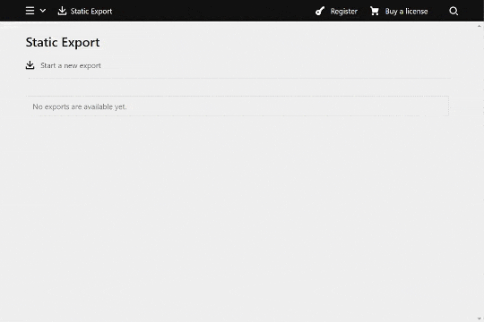

# k3-export-area
Export a static version of your website.



## Installation

### Download

Download and copy this repository to `/site/plugins/k3-export-area`.

### Git submodule

```
git submodule add https://github.com/rasteiner/k3-export-area.git site/plugins/k3-export-area
```

### Composer

Currently not available on composer. Will be available as soon as it is released in a stable version.

## Configuration

There 3 fundamental options to configure.

1. `rasteiner.export.base`: The base path selection on which the export will be based.  
  Default: `/`  
  Types: `string`, `array`, `callable:string|array`  
  Examples:
    ```php
    // the website will be deployable in any webroot
    'rasteiner.export.base' => '/', 

    // the website will be deployable on https://example.com
    'rasteiner.export.base' => 'https://example.com', 

    // the user can choose between these two
    'rasteiner.export.base' => [
        'https://example.com',
        'https://wip.example.com',
    ],

    // the user can choose between the two, change the displayed text
    'rasteiner.export.base' => [
        'https://example.com' => 'Production',
        'https://wip.example.com' => 'Staging',
    ],
    ```

2. `rasteiner.export.pages`: The pages that will be rendered.  
  Default: `fn($kirby) => $kirby->site()->index()`  
  Type: `callable:Pages`  
  Example:
    ```php
    'rasteiner.export.pages' => fn($kirby) => $kirby->site()->index()->template(['default', 'contact']),
    ```
3. `rasteiner.export.assets`: Other assets that will be copied.  
  Default: `fn($kirby) => []`  
  Type: `callable:array` (The returned array should be associative: [destination => source])  
  Example:
    ```php
    'rasteiner.export.assets' => function($kirby) {
        //copy all files in the `/assets` folder except *.js and *.css files
        $assetsRoot = $kirby->root('assets');
        $index = Dir::index($assetsRoot, true, []);
        $files = [];
        foreach ($index as $path) {
            $root = "$assetsRoot/$path";
            if(!is_dir($root)) {
                $extension = F::extension($path);
                if($extension !== 'css' && $extension !== 'js') {
                    $files["assets/$path"] = $root;
                }
            }
        }
        
        return $files;
    },
    ```

> ℹ  
Files that in your templates are referenced with a call to `->url()` will be exported automatically.  
Thumbnails will be exported automatically.  
CSS and javascript files will be exported and fingerprinted automatically when referenced via the `js()` and `css()` helpers.

## License
[MIT](LICENSE)
